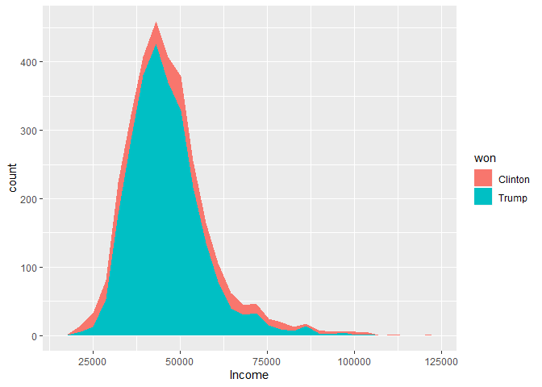
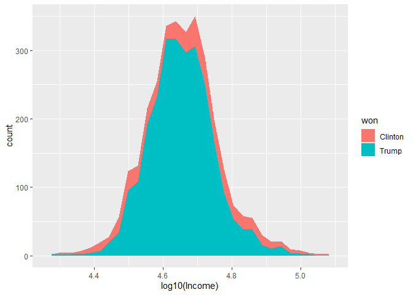
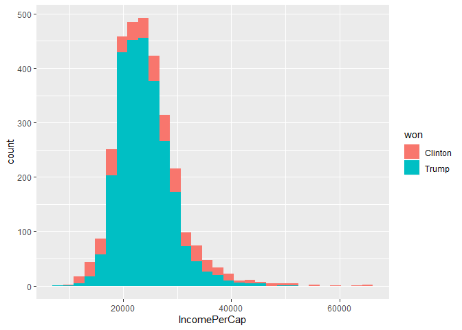
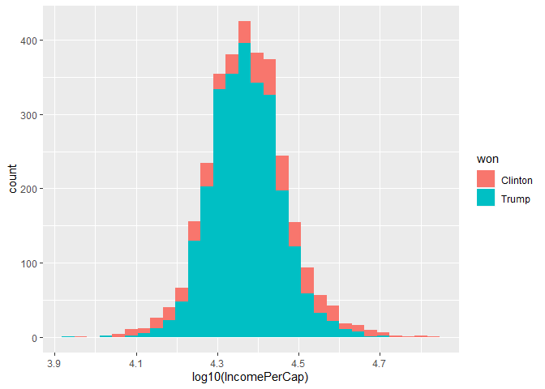
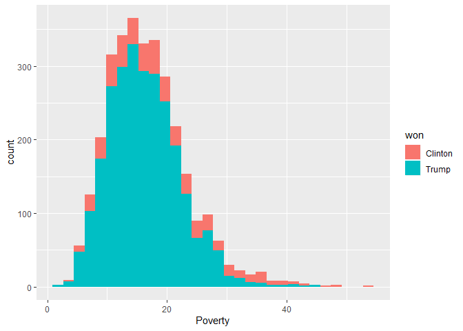
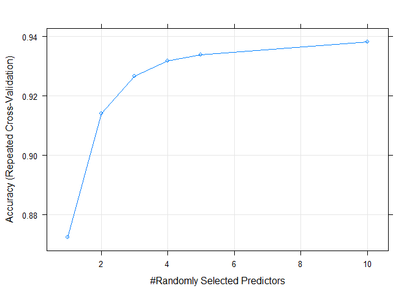
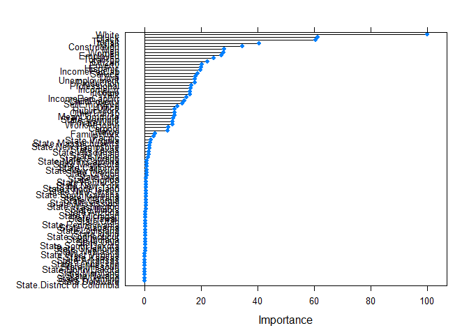
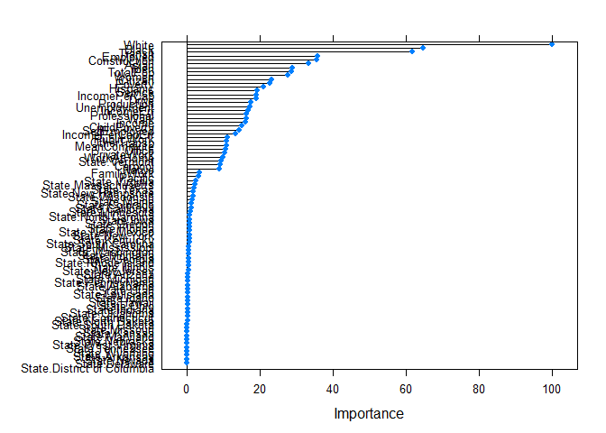

# Load libraries


```r
library(tidyverse)
library(knitr)
library(kableExtra)
library(caret)
```

## Load functions


```r
source("functions/table_styling.R")
source("functions/calculate_optimal_bin_number.R")
```

## Read data


```r
data <- read_tsv("data/US_2016_election_and_2015_census_data.tsv")
```

```
## Parsed with column specification:
## cols(
##   .default = col_double(),
##   State = col_character(),
##   County = col_character(),
##   per_point_diff = col_character(),
##   state_abbr = col_character(),
##   county_name = col_character(),
##   won = col_character()
## )
```

```
## See spec(...) for full column specifications.
```

# Data exploration

The dataset, with over 40 columns, is too big for a pairplot to be used. 
However, there are "groups" of variables that can be evaluated together.

## Population and demographics

Make a histogram of total population.


```r
# Calculate optimal number of bins
b <- calculate_optimal_bin_number(data %>% 
                                                                        select(TotalPop) %>% 
                                                                        mutate(TotalPop = log10(TotalPop)) %>% 
                                                                        as_vector())
# Plot a log10(TotalPop) histogram
data %>% 
  ggplot(aes(log10(TotalPop))) +
  geom_histogram(aes(fill = won), bins = b) +
  scale_y_continuous(limits = c(0, 250), expand = c(0, 0)) + # This is because I want 0 to be at the x axis
  theme_classic()
```

<!-- -->

It seems like Trump won a lot more counties than Clinton, and Clinton seems to
be more succesful in densely populated counties.

It would be interesting to see the average population density and demographics
by the candidate that won the county.


```r
data %>% 
  select(TotalPop:Pacific, won) %>%
  group_by(won) %>% 
  summarise_all("mean") %>% 
  kable(caption = "Means for demographic variables for counties that each candidate won.") %>% 
  table_styling()
```

<div style="border: 1px solid #ddd; padding: 0px; overflow-y: scroll; height:100%; overflow-x: scroll; width:100%; "><table class="table table-striped" style="margin-left: auto; margin-right: auto;">
<caption>Means for demographic variables for counties that each candidate won.</caption>
 <thead>
  <tr>
   <th style="text-align:left;position: sticky; top:0; background-color: #FFFFFF;position: sticky; top:0; background-color: #FFFFFF;"> won </th>
   <th style="text-align:right;position: sticky; top:0; background-color: #FFFFFF;position: sticky; top:0; background-color: #FFFFFF;"> TotalPop </th>
   <th style="text-align:right;position: sticky; top:0; background-color: #FFFFFF;position: sticky; top:0; background-color: #FFFFFF;"> Men </th>
   <th style="text-align:right;position: sticky; top:0; background-color: #FFFFFF;position: sticky; top:0; background-color: #FFFFFF;"> Women </th>
   <th style="text-align:right;position: sticky; top:0; background-color: #FFFFFF;position: sticky; top:0; background-color: #FFFFFF;"> Hispanic </th>
   <th style="text-align:right;position: sticky; top:0; background-color: #FFFFFF;position: sticky; top:0; background-color: #FFFFFF;"> White </th>
   <th style="text-align:right;position: sticky; top:0; background-color: #FFFFFF;position: sticky; top:0; background-color: #FFFFFF;"> Black </th>
   <th style="text-align:right;position: sticky; top:0; background-color: #FFFFFF;position: sticky; top:0; background-color: #FFFFFF;"> Native </th>
   <th style="text-align:right;position: sticky; top:0; background-color: #FFFFFF;position: sticky; top:0; background-color: #FFFFFF;"> Asian </th>
   <th style="text-align:right;position: sticky; top:0; background-color: #FFFFFF;position: sticky; top:0; background-color: #FFFFFF;"> Pacific </th>
  </tr>
 </thead>
<tbody>
  <tr>
   <td style="text-align:left;"> Clinton </td>
   <td style="text-align:right;"> 354177.87 </td>
   <td style="text-align:right;"> 173268.93 </td>
   <td style="text-align:right;"> 180908.94 </td>
   <td style="text-align:right;"> 15.379466 </td>
   <td style="text-align:right;"> 54.94251 </td>
   <td style="text-align:right;"> 21.281314 </td>
   <td style="text-align:right;"> 2.434908 </td>
   <td style="text-align:right;"> 3.5669405 </td>
   <td style="text-align:right;"> 0.1599589 </td>
  </tr>
  <tr>
   <td style="text-align:left;"> Trump </td>
   <td style="text-align:right;"> 54589.31 </td>
   <td style="text-align:right;"> 27035.47 </td>
   <td style="text-align:right;"> 27553.84 </td>
   <td style="text-align:right;"> 7.658362 </td>
   <td style="text-align:right;"> 81.75360 </td>
   <td style="text-align:right;"> 6.664381 </td>
   <td style="text-align:right;"> 1.322591 </td>
   <td style="text-align:right;"> 0.7707429 </td>
   <td style="text-align:right;"> 0.0512381 </td>
  </tr>
</tbody>
</table></div>

It seems like that not only did Clinton win more popolous countries but these
counties tended to be less white and a higher degree of minorites, i.e. they 
were more demographically diverse.

## Income, poverty and type of work

### Income

`Income` is the median household income.


```r
# Frequency are plots
ggplot(data, aes(Income)) + geom_area(aes(y = ..count.., fill = won, group = won), stat = "bin")
```

```
## `stat_bin()` using `bins = 30`. Pick better value with `binwidth`.
```

```
## Warning: Removed 1 rows containing non-finite values (stat_bin).
```

<!-- -->

```r
# Log10
ggplot(data, aes(log10(Income))) + geom_area(aes(y = ..count.., fill = won, group = won), stat = "bin")
```

```
## `stat_bin()` using `bins = 30`. Pick better value with `binwidth`.
```

```
## Warning: Removed 1 rows containing non-finite values (stat_bin).
```

<!-- -->

Median income doesn*t seem to be that predictive of voting patterns.

Similar plots for `IncomePerCap`.


```r
data %>% 
  ggplot(aes(IncomePerCap)) +
  geom_histogram(aes(fill = won))
```

```
## `stat_bin()` using `bins = 30`. Pick better value with `binwidth`.
```

<!-- -->

```r
data %>% 
  ggplot(aes(log10(IncomePerCap))) +
  geom_histogram(aes(fill = won))
```

```
## `stat_bin()` using `bins = 30`. Pick better value with `binwidth`.
```

<!-- -->

Both median household income and income per capita doesn't seem to correlate 
with voting patterns. Although among the richest counties there might be a 
tendency to vote for the democratic nominee.

### Poverty


```r
data %>% 
  ggplot(aes(Poverty)) +
  geom_histogram(aes(fill = won))
```

```
## `stat_bin()` using `bins = 30`. Pick better value with `binwidth`.
```

<!-- -->

`Poverty` shows similar patterns.

### Type of work and commute


```r
data %>% 
  select(Professional:Unemployment, won) %>% 
  group_by(won) %>% 
  summarise_all("mean") %>% 
  kable() %>% 
  table_styling()
```

<div style="border: 1px solid #ddd; padding: 0px; overflow-y: scroll; height:100%; overflow-x: scroll; width:100%; "><table class="table table-striped" style="margin-left: auto; margin-right: auto;">
 <thead>
  <tr>
   <th style="text-align:left;position: sticky; top:0; background-color: #FFFFFF;position: sticky; top:0; background-color: #FFFFFF;"> won </th>
   <th style="text-align:right;position: sticky; top:0; background-color: #FFFFFF;position: sticky; top:0; background-color: #FFFFFF;"> Professional </th>
   <th style="text-align:right;position: sticky; top:0; background-color: #FFFFFF;position: sticky; top:0; background-color: #FFFFFF;"> Service </th>
   <th style="text-align:right;position: sticky; top:0; background-color: #FFFFFF;position: sticky; top:0; background-color: #FFFFFF;"> Office </th>
   <th style="text-align:right;position: sticky; top:0; background-color: #FFFFFF;position: sticky; top:0; background-color: #FFFFFF;"> Construction </th>
   <th style="text-align:right;position: sticky; top:0; background-color: #FFFFFF;position: sticky; top:0; background-color: #FFFFFF;"> Production </th>
   <th style="text-align:right;position: sticky; top:0; background-color: #FFFFFF;position: sticky; top:0; background-color: #FFFFFF;"> Drive </th>
   <th style="text-align:right;position: sticky; top:0; background-color: #FFFFFF;position: sticky; top:0; background-color: #FFFFFF;"> Carpool </th>
   <th style="text-align:right;position: sticky; top:0; background-color: #FFFFFF;position: sticky; top:0; background-color: #FFFFFF;"> Transit </th>
   <th style="text-align:right;position: sticky; top:0; background-color: #FFFFFF;position: sticky; top:0; background-color: #FFFFFF;"> Walk </th>
   <th style="text-align:right;position: sticky; top:0; background-color: #FFFFFF;position: sticky; top:0; background-color: #FFFFFF;"> OtherTransp </th>
   <th style="text-align:right;position: sticky; top:0; background-color: #FFFFFF;position: sticky; top:0; background-color: #FFFFFF;"> WorkAtHome </th>
   <th style="text-align:right;position: sticky; top:0; background-color: #FFFFFF;position: sticky; top:0; background-color: #FFFFFF;"> MeanCommute </th>
   <th style="text-align:right;position: sticky; top:0; background-color: #FFFFFF;position: sticky; top:0; background-color: #FFFFFF;"> Employed </th>
   <th style="text-align:right;position: sticky; top:0; background-color: #FFFFFF;position: sticky; top:0; background-color: #FFFFFF;"> PrivateWork </th>
   <th style="text-align:right;position: sticky; top:0; background-color: #FFFFFF;position: sticky; top:0; background-color: #FFFFFF;"> PublicWork </th>
   <th style="text-align:right;position: sticky; top:0; background-color: #FFFFFF;position: sticky; top:0; background-color: #FFFFFF;"> SelfEmployed </th>
   <th style="text-align:right;position: sticky; top:0; background-color: #FFFFFF;position: sticky; top:0; background-color: #FFFFFF;"> FamilyWork </th>
   <th style="text-align:right;position: sticky; top:0; background-color: #FFFFFF;position: sticky; top:0; background-color: #FFFFFF;"> Unemployment </th>
  </tr>
 </thead>
<tbody>
  <tr>
   <td style="text-align:left;"> Clinton </td>
   <td style="text-align:right;"> 35.01212 </td>
   <td style="text-align:right;"> 20.06858 </td>
   <td style="text-align:right;"> 22.76304 </td>
   <td style="text-align:right;"> 9.756263 </td>
   <td style="text-align:right;"> 12.40103 </td>
   <td style="text-align:right;"> 76.10739 </td>
   <td style="text-align:right;"> 10.08994 </td>
   <td style="text-align:right;"> 3.4488706 </td>
   <td style="text-align:right;"> 3.795893 </td>
   <td style="text-align:right;"> 1.987064 </td>
   <td style="text-align:right;"> 4.572485 </td>
   <td style="text-align:right;"> 24.01971 </td>
   <td style="text-align:right;"> 167326.48 </td>
   <td style="text-align:right;"> 74.68255 </td>
   <td style="text-align:right;"> 18.82649 </td>
   <td style="text-align:right;"> 6.307803 </td>
   <td style="text-align:right;"> 0.1827515 </td>
   <td style="text-align:right;"> 9.648665 </td>
  </tr>
  <tr>
   <td style="text-align:left;"> Trump </td>
   <td style="text-align:right;"> 30.29859 </td>
   <td style="text-align:right;"> 17.92309 </td>
   <td style="text-align:right;"> 22.04255 </td>
   <td style="text-align:right;"> 13.275009 </td>
   <td style="text-align:right;"> 16.46091 </td>
   <td style="text-align:right;"> 80.01010 </td>
   <td style="text-align:right;"> 10.35642 </td>
   <td style="text-align:right;"> 0.5063619 </td>
   <td style="text-align:right;"> 2.975314 </td>
   <td style="text-align:right;"> 1.449752 </td>
   <td style="text-align:right;"> 4.702248 </td>
   <td style="text-align:right;"> 23.12255 </td>
   <td style="text-align:right;"> 24346.14 </td>
   <td style="text-align:right;"> 74.57280 </td>
   <td style="text-align:right;"> 16.89109 </td>
   <td style="text-align:right;"> 8.224457 </td>
   <td style="text-align:right;"> 0.3117333 </td>
   <td style="text-align:right;"> 7.454667 </td>
  </tr>
</tbody>
</table></div>

There are some differences in the averages for these variables, it seems like
counties that voted for Clinton were more educated and lived in more urban 
areas.

# Machine learning

## PCA

## Preprocessing 

Remove all election data except `won`.


```r
data_ml <- data %>% 
  select(CensusId:Unemployment, won) %>% 
  mutate(CensusId = as.character(CensusId))

glimpse(data_ml)
```

```
## Observations: 3,112
## Variables: 38
## $ CensusId        <chr> "1001", "1003", "1005", "1007", "1009", "1011", "10...
## $ State           <chr> "Alabama", "Alabama", "Alabama", "Alabama", "Alabam...
## $ County          <chr> "Autauga", "Baldwin", "Barbour", "Bibb", "Blount", ...
## $ TotalPop        <dbl> 55221, 195121, 26932, 22604, 57710, 10678, 20354, 1...
## $ Men             <dbl> 26745, 95314, 14497, 12073, 28512, 5660, 9502, 5627...
## $ Women           <dbl> 28476, 99807, 12435, 10531, 29198, 5018, 10852, 603...
## $ Hispanic        <dbl> 2.6, 4.5, 4.6, 2.2, 8.6, 4.4, 1.2, 3.5, 0.4, 1.5, 7...
## $ White           <dbl> 75.8, 83.1, 46.2, 74.5, 87.9, 22.2, 53.3, 73.0, 57....
## $ Black           <dbl> 18.5, 9.5, 46.7, 21.4, 1.5, 70.7, 43.8, 20.3, 40.3,...
## $ Native          <dbl> 0.4, 0.6, 0.2, 0.4, 0.3, 1.2, 0.1, 0.2, 0.2, 0.6, 0...
## $ Asian           <dbl> 1.0, 0.7, 0.4, 0.1, 0.1, 0.2, 0.4, 0.9, 0.8, 0.3, 0...
## $ Pacific         <dbl> 0.0, 0.0, 0.0, 0.0, 0.0, 0.0, 0.0, 0.0, 0.0, 0.0, 0...
## $ Citizen         <dbl> 40725, 147695, 20714, 17495, 42345, 8057, 15581, 88...
## $ Income          <dbl> 51281, 50254, 32964, 38678, 45813, 31938, 32229, 41...
## $ IncomeErr       <dbl> 2391, 1263, 2973, 3995, 3141, 5884, 1793, 925, 2949...
## $ IncomePerCap    <dbl> 24974, 27317, 16824, 18431, 20532, 17580, 18390, 21...
## $ IncomePerCapErr <dbl> 1080, 711, 798, 1618, 708, 2055, 714, 489, 1366, 15...
## $ Poverty         <dbl> 12.9, 13.4, 26.7, 16.8, 16.7, 24.6, 25.4, 20.5, 21....
## $ ChildPoverty    <dbl> 18.6, 19.2, 45.3, 27.9, 27.2, 38.4, 39.2, 31.6, 37....
## $ Professional    <dbl> 33.2, 33.1, 26.8, 21.5, 28.5, 18.8, 27.5, 27.3, 23....
## $ Service         <dbl> 17.0, 17.7, 16.1, 17.9, 14.1, 15.0, 16.6, 17.7, 14....
## $ Office          <dbl> 24.2, 27.1, 23.1, 17.8, 23.9, 19.7, 21.9, 24.2, 26....
## $ Construction    <dbl> 8.6, 10.8, 10.8, 19.0, 13.5, 20.1, 10.3, 10.5, 11.5...
## $ Production      <dbl> 17.1, 11.2, 23.1, 23.7, 19.9, 26.4, 23.7, 20.4, 24....
## $ Drive           <dbl> 87.5, 84.7, 83.8, 83.2, 84.9, 74.9, 84.5, 85.3, 85....
## $ Carpool         <dbl> 8.8, 8.8, 10.9, 13.5, 11.2, 14.9, 12.4, 9.4, 11.9, ...
## $ Transit         <dbl> 0.1, 0.1, 0.4, 0.5, 0.4, 0.7, 0.0, 0.2, 0.2, 0.2, 0...
## $ Walk            <dbl> 0.5, 1.0, 1.8, 0.6, 0.9, 5.0, 0.8, 1.2, 0.3, 0.6, 1...
## $ OtherTransp     <dbl> 1.3, 1.4, 1.5, 1.5, 0.4, 1.7, 0.6, 1.2, 0.4, 0.7, 1...
## $ WorkAtHome      <dbl> 1.8, 3.9, 1.6, 0.7, 2.3, 2.8, 1.7, 2.7, 2.1, 2.5, 1...
## $ MeanCommute     <dbl> 26.5, 26.4, 24.1, 28.8, 34.9, 27.5, 24.6, 24.1, 25....
## $ Employed        <dbl> 23986, 85953, 8597, 8294, 22189, 3865, 7813, 47401,...
## $ PrivateWork     <dbl> 73.6, 81.5, 71.8, 76.8, 82.0, 79.5, 77.4, 74.1, 85....
## $ PublicWork      <dbl> 20.9, 12.3, 20.8, 16.1, 13.5, 15.1, 16.2, 20.8, 12....
## $ SelfEmployed    <dbl> 5.5, 5.8, 7.3, 6.7, 4.2, 5.4, 6.2, 5.0, 2.8, 7.9, 4...
## $ FamilyWork      <dbl> 0.0, 0.4, 0.1, 0.4, 0.4, 0.0, 0.2, 0.1, 0.0, 0.5, 0...
## $ Unemployment    <dbl> 7.6, 7.5, 17.6, 8.3, 7.7, 18.0, 10.9, 12.3, 8.9, 7....
## $ won             <chr> "Trump", "Trump", "Trump", "Trump", "Trump", "Clint...
```

Scale and center data using `caret`'s preprocess method.


```r
# Define ML method (center, scale)
pre_proc_values <- preProcess(data_ml, method = c("center", "scale"))


data_processed <- predict(pre_proc_values, data_ml)
glimpse(data_processed)
```

```
## Observations: 3,112
## Variables: 38
## $ CensusId        <chr> "1001", "1003", "1005", "1007", "1009", "1011", "10...
## $ State           <chr> "Alabama", "Alabama", "Alabama", "Alabama", "Alabam...
## $ County          <chr> "Autauga", "Baldwin", "Barbour", "Bibb", "Blount", ...
## $ TotalPop        <dbl> -0.14255130, 0.28863571, -0.22974108, -0.24308044, ...
## $ Men             <dbl> -0.14556159, 0.28512431, -0.22249199, -0.23771728, ...
## $ Women           <dbl> -0.13961894, 0.29195190, -0.23667111, -0.24819080, ...
## $ Hispanic        <dbl> -0.46245483, -0.32224198, -0.31486236, -0.49197332,...
## $ White           <dbl> -0.08939784, 0.28184195, -1.59469890, -0.15550904, ...
## $ Black           <dbl> 0.66129267, 0.03796747, 2.61437830, 0.86214190, -0....
## $ Native          <dbl> -0.17490227, -0.14300495, -0.20679959, -0.17490227,...
## $ Asian           <dbl> -0.084323474, -0.205755521, -0.327187567, -0.448619...
## $ Pacific         <dbl> -0.17901461, -0.17901461, -0.17901461, -0.17901461,...
## $ Citizen         <dbl> -0.14680944, 0.36652235, -0.24283900, -0.25828646, ...
## $ Income          <dbl> 0.380945122, 0.296240022, -1.129807868, -0.65852749...
## $ IncomeErr       <dbl> -0.25010956, -0.85206493, 0.06047380, 0.60586245, 0...
## $ IncomePerCap    <dbl> 0.12111290, 0.52724344, -1.29159041, -1.01303652, -...
## $ IncomePerCapErr <dbl> -0.2774767059, -0.6319764219, -0.5483951881, 0.2393...
## $ Poverty         <dbl> -0.583117867, -0.507064540, 1.515953958, 0.01009808...
## $ ChildPoverty    <dbl> -0.46365370, -0.40503417, 2.14491518, 0.44494894, 0...
## $ Professional    <dbl> 0.3383535, 0.3227164, -0.6624215, -1.4911884, -0.39...
## $ Service         <dbl> -0.35258176, -0.15652200, -0.60465859, -0.10050493,...
## $ Office          <dbl> 0.6590762, 1.5938455, 0.3045085, -1.4038631, 0.5623...
## $ Construction    <dbl> -0.975028335, -0.454932192, -0.454932192, 1.4836079...
## $ Production      <dbl> 0.22370809, -0.81195997, 1.27692985, 1.38225203, 0....
## $ Drive           <dbl> 1.2031708, 0.7872929, 0.6536179, 0.5645012, 0.81699...
## $ Carpool         <dbl> -0.531658718, -0.531658718, 0.205431539, 1.11801947...
## $ Transit         <dbl> -0.27978971, -0.27978971, -0.18295857, -0.15068153,...
## $ Walk            <dbl> -0.9595364, -0.7752743, -0.4804550, -0.9226840, -0....
## $ OtherTransp     <dbl> -0.20729266, -0.11864421, -0.02999576, -0.02999576,...
## $ WorkAtHome      <dbl> -0.91200039, -0.24744796, -0.97529110, -1.26009928,...
## $ MeanCommute     <dbl> 0.59904538, 0.58053948, 0.15490369, 1.02468117, 2.1...
## $ Employed        <dbl> -0.149478133, 0.257937724, -0.250656544, -0.2526486...
## $ PrivateWork     <dbl> -0.13111498, 0.91518325, -0.36951205, 0.29270202, 0...
## $ PublicWork      <dbl> 0.60875872, -0.80388750, 0.59233261, -0.17969498, -...
## $ SelfEmployed    <dbl> -0.616024577, -0.539800200, -0.158678316, -0.311127...
## $ FamilyWork      <dbl> -0.6353964, 0.2363565, -0.4174582, 0.2363565, 0.236...
## $ Unemployment    <dbl> -0.05616265, -0.08452651, 2.78022418, 0.14238443, -...
## $ won             <chr> "Trump", "Trump", "Trump", "Trump", "Trump", "Clint...
```

Convert outcome to binary.


```r
data_processed <- data_processed %>% 
  mutate(won = if_else(won == "Clinton", 1, 0))

id <- data_ml$CensusId
data_processed <- data_processed %>% 
  mutate(CensusId = NULL,
         County = NULL)

glimpse(data_processed)
```

```
## Observations: 3,112
## Variables: 36
## $ State           <chr> "Alabama", "Alabama", "Alabama", "Alabama", "Alabam...
## $ TotalPop        <dbl> -0.14255130, 0.28863571, -0.22974108, -0.24308044, ...
## $ Men             <dbl> -0.14556159, 0.28512431, -0.22249199, -0.23771728, ...
## $ Women           <dbl> -0.13961894, 0.29195190, -0.23667111, -0.24819080, ...
## $ Hispanic        <dbl> -0.46245483, -0.32224198, -0.31486236, -0.49197332,...
## $ White           <dbl> -0.08939784, 0.28184195, -1.59469890, -0.15550904, ...
## $ Black           <dbl> 0.66129267, 0.03796747, 2.61437830, 0.86214190, -0....
## $ Native          <dbl> -0.17490227, -0.14300495, -0.20679959, -0.17490227,...
## $ Asian           <dbl> -0.084323474, -0.205755521, -0.327187567, -0.448619...
## $ Pacific         <dbl> -0.17901461, -0.17901461, -0.17901461, -0.17901461,...
## $ Citizen         <dbl> -0.14680944, 0.36652235, -0.24283900, -0.25828646, ...
## $ Income          <dbl> 0.380945122, 0.296240022, -1.129807868, -0.65852749...
## $ IncomeErr       <dbl> -0.25010956, -0.85206493, 0.06047380, 0.60586245, 0...
## $ IncomePerCap    <dbl> 0.12111290, 0.52724344, -1.29159041, -1.01303652, -...
## $ IncomePerCapErr <dbl> -0.2774767059, -0.6319764219, -0.5483951881, 0.2393...
## $ Poverty         <dbl> -0.583117867, -0.507064540, 1.515953958, 0.01009808...
## $ ChildPoverty    <dbl> -0.46365370, -0.40503417, 2.14491518, 0.44494894, 0...
## $ Professional    <dbl> 0.3383535, 0.3227164, -0.6624215, -1.4911884, -0.39...
## $ Service         <dbl> -0.35258176, -0.15652200, -0.60465859, -0.10050493,...
## $ Office          <dbl> 0.6590762, 1.5938455, 0.3045085, -1.4038631, 0.5623...
## $ Construction    <dbl> -0.975028335, -0.454932192, -0.454932192, 1.4836079...
## $ Production      <dbl> 0.22370809, -0.81195997, 1.27692985, 1.38225203, 0....
## $ Drive           <dbl> 1.2031708, 0.7872929, 0.6536179, 0.5645012, 0.81699...
## $ Carpool         <dbl> -0.531658718, -0.531658718, 0.205431539, 1.11801947...
## $ Transit         <dbl> -0.27978971, -0.27978971, -0.18295857, -0.15068153,...
## $ Walk            <dbl> -0.9595364, -0.7752743, -0.4804550, -0.9226840, -0....
## $ OtherTransp     <dbl> -0.20729266, -0.11864421, -0.02999576, -0.02999576,...
## $ WorkAtHome      <dbl> -0.91200039, -0.24744796, -0.97529110, -1.26009928,...
## $ MeanCommute     <dbl> 0.59904538, 0.58053948, 0.15490369, 1.02468117, 2.1...
## $ Employed        <dbl> -0.149478133, 0.257937724, -0.250656544, -0.2526486...
## $ PrivateWork     <dbl> -0.13111498, 0.91518325, -0.36951205, 0.29270202, 0...
## $ PublicWork      <dbl> 0.60875872, -0.80388750, 0.59233261, -0.17969498, -...
## $ SelfEmployed    <dbl> -0.616024577, -0.539800200, -0.158678316, -0.311127...
## $ FamilyWork      <dbl> -0.6353964, 0.2363565, -0.4174582, 0.2363565, 0.236...
## $ Unemployment    <dbl> -0.05616265, -0.08452651, 2.78022418, 0.14238443, -...
## $ won             <dbl> 0, 0, 0, 0, 0, 1, 0, 0, 0, 0, 0, 0, 0, 0, 0, 0, 0, ...
```

Create dummy variables using One-hot encoding for `State`.


```r
# Make State into a factor
data_processed <- data_processed %>% 
  mutate(State = as_factor(State))

# Converting every categorical variable to numerical using dummy variables
dummies <- dummyVars(" ~ .", data_processed, fullRank = FALSE)
data_transformed <- as_tibble(predict(dummies, newdata = data_processed))

glimpse(data_transformed)
```

```
## Observations: 3,112
## Variables: 85
## $ State.Alabama                <dbl> 1, 1, 1, 1, 1, 1, 1, 1, 1, 1, 1, 1, 1,...
## $ State.Arizona                <dbl> 0, 0, 0, 0, 0, 0, 0, 0, 0, 0, 0, 0, 0,...
## $ State.Arkansas               <dbl> 0, 0, 0, 0, 0, 0, 0, 0, 0, 0, 0, 0, 0,...
## $ State.California             <dbl> 0, 0, 0, 0, 0, 0, 0, 0, 0, 0, 0, 0, 0,...
## $ State.Colorado               <dbl> 0, 0, 0, 0, 0, 0, 0, 0, 0, 0, 0, 0, 0,...
## $ State.Connecticut            <dbl> 0, 0, 0, 0, 0, 0, 0, 0, 0, 0, 0, 0, 0,...
## $ State.Delaware               <dbl> 0, 0, 0, 0, 0, 0, 0, 0, 0, 0, 0, 0, 0,...
## $ `State.District of Columbia` <dbl> 0, 0, 0, 0, 0, 0, 0, 0, 0, 0, 0, 0, 0,...
## $ State.Florida                <dbl> 0, 0, 0, 0, 0, 0, 0, 0, 0, 0, 0, 0, 0,...
## $ State.Georgia                <dbl> 0, 0, 0, 0, 0, 0, 0, 0, 0, 0, 0, 0, 0,...
## $ State.Hawaii                 <dbl> 0, 0, 0, 0, 0, 0, 0, 0, 0, 0, 0, 0, 0,...
## $ State.Idaho                  <dbl> 0, 0, 0, 0, 0, 0, 0, 0, 0, 0, 0, 0, 0,...
## $ State.Illinois               <dbl> 0, 0, 0, 0, 0, 0, 0, 0, 0, 0, 0, 0, 0,...
## $ State.Indiana                <dbl> 0, 0, 0, 0, 0, 0, 0, 0, 0, 0, 0, 0, 0,...
## $ State.Iowa                   <dbl> 0, 0, 0, 0, 0, 0, 0, 0, 0, 0, 0, 0, 0,...
## $ State.Kansas                 <dbl> 0, 0, 0, 0, 0, 0, 0, 0, 0, 0, 0, 0, 0,...
## $ State.Kentucky               <dbl> 0, 0, 0, 0, 0, 0, 0, 0, 0, 0, 0, 0, 0,...
## $ State.Louisiana              <dbl> 0, 0, 0, 0, 0, 0, 0, 0, 0, 0, 0, 0, 0,...
## $ State.Maine                  <dbl> 0, 0, 0, 0, 0, 0, 0, 0, 0, 0, 0, 0, 0,...
## $ State.Maryland               <dbl> 0, 0, 0, 0, 0, 0, 0, 0, 0, 0, 0, 0, 0,...
## $ State.Massachusetts          <dbl> 0, 0, 0, 0, 0, 0, 0, 0, 0, 0, 0, 0, 0,...
## $ State.Michigan               <dbl> 0, 0, 0, 0, 0, 0, 0, 0, 0, 0, 0, 0, 0,...
## $ State.Minnesota              <dbl> 0, 0, 0, 0, 0, 0, 0, 0, 0, 0, 0, 0, 0,...
## $ State.Mississippi            <dbl> 0, 0, 0, 0, 0, 0, 0, 0, 0, 0, 0, 0, 0,...
## $ State.Missouri               <dbl> 0, 0, 0, 0, 0, 0, 0, 0, 0, 0, 0, 0, 0,...
## $ State.Montana                <dbl> 0, 0, 0, 0, 0, 0, 0, 0, 0, 0, 0, 0, 0,...
## $ State.Nebraska               <dbl> 0, 0, 0, 0, 0, 0, 0, 0, 0, 0, 0, 0, 0,...
## $ State.Nevada                 <dbl> 0, 0, 0, 0, 0, 0, 0, 0, 0, 0, 0, 0, 0,...
## $ `State.New Hampshire`        <dbl> 0, 0, 0, 0, 0, 0, 0, 0, 0, 0, 0, 0, 0,...
## $ `State.New Jersey`           <dbl> 0, 0, 0, 0, 0, 0, 0, 0, 0, 0, 0, 0, 0,...
## $ `State.New Mexico`           <dbl> 0, 0, 0, 0, 0, 0, 0, 0, 0, 0, 0, 0, 0,...
## $ `State.New York`             <dbl> 0, 0, 0, 0, 0, 0, 0, 0, 0, 0, 0, 0, 0,...
## $ `State.North Carolina`       <dbl> 0, 0, 0, 0, 0, 0, 0, 0, 0, 0, 0, 0, 0,...
## $ `State.North Dakota`         <dbl> 0, 0, 0, 0, 0, 0, 0, 0, 0, 0, 0, 0, 0,...
## $ State.Ohio                   <dbl> 0, 0, 0, 0, 0, 0, 0, 0, 0, 0, 0, 0, 0,...
## $ State.Oklahoma               <dbl> 0, 0, 0, 0, 0, 0, 0, 0, 0, 0, 0, 0, 0,...
## $ State.Oregon                 <dbl> 0, 0, 0, 0, 0, 0, 0, 0, 0, 0, 0, 0, 0,...
## $ State.Pennsylvania           <dbl> 0, 0, 0, 0, 0, 0, 0, 0, 0, 0, 0, 0, 0,...
## $ `State.Rhode Island`         <dbl> 0, 0, 0, 0, 0, 0, 0, 0, 0, 0, 0, 0, 0,...
## $ `State.South Carolina`       <dbl> 0, 0, 0, 0, 0, 0, 0, 0, 0, 0, 0, 0, 0,...
## $ `State.South Dakota`         <dbl> 0, 0, 0, 0, 0, 0, 0, 0, 0, 0, 0, 0, 0,...
## $ State.Tennessee              <dbl> 0, 0, 0, 0, 0, 0, 0, 0, 0, 0, 0, 0, 0,...
## $ State.Texas                  <dbl> 0, 0, 0, 0, 0, 0, 0, 0, 0, 0, 0, 0, 0,...
## $ State.Utah                   <dbl> 0, 0, 0, 0, 0, 0, 0, 0, 0, 0, 0, 0, 0,...
## $ State.Vermont                <dbl> 0, 0, 0, 0, 0, 0, 0, 0, 0, 0, 0, 0, 0,...
## $ State.Virginia               <dbl> 0, 0, 0, 0, 0, 0, 0, 0, 0, 0, 0, 0, 0,...
## $ State.Washington             <dbl> 0, 0, 0, 0, 0, 0, 0, 0, 0, 0, 0, 0, 0,...
## $ `State.West Virginia`        <dbl> 0, 0, 0, 0, 0, 0, 0, 0, 0, 0, 0, 0, 0,...
## $ State.Wisconsin              <dbl> 0, 0, 0, 0, 0, 0, 0, 0, 0, 0, 0, 0, 0,...
## $ State.Wyoming                <dbl> 0, 0, 0, 0, 0, 0, 0, 0, 0, 0, 0, 0, 0,...
## $ TotalPop                     <dbl> -0.14255130, 0.28863571, -0.22974108, ...
## $ Men                          <dbl> -0.14556159, 0.28512431, -0.22249199, ...
## $ Women                        <dbl> -0.13961894, 0.29195190, -0.23667111, ...
## $ Hispanic                     <dbl> -0.46245483, -0.32224198, -0.31486236,...
## $ White                        <dbl> -0.08939784, 0.28184195, -1.59469890, ...
## $ Black                        <dbl> 0.66129267, 0.03796747, 2.61437830, 0....
## $ Native                       <dbl> -0.17490227, -0.14300495, -0.20679959,...
## $ Asian                        <dbl> -0.084323474, -0.205755521, -0.3271875...
## $ Pacific                      <dbl> -0.17901461, -0.17901461, -0.17901461,...
## $ Citizen                      <dbl> -0.14680944, 0.36652235, -0.24283900, ...
## $ Income                       <dbl> 0.380945122, 0.296240022, -1.129807868...
## $ IncomeErr                    <dbl> -0.25010956, -0.85206493, 0.06047380, ...
## $ IncomePerCap                 <dbl> 0.12111290, 0.52724344, -1.29159041, -...
## $ IncomePerCapErr              <dbl> -0.2774767059, -0.6319764219, -0.54839...
## $ Poverty                      <dbl> -0.583117867, -0.507064540, 1.51595395...
## $ ChildPoverty                 <dbl> -0.46365370, -0.40503417, 2.14491518, ...
## $ Professional                 <dbl> 0.3383535, 0.3227164, -0.6624215, -1.4...
## $ Service                      <dbl> -0.35258176, -0.15652200, -0.60465859,...
## $ Office                       <dbl> 0.6590762, 1.5938455, 0.3045085, -1.40...
## $ Construction                 <dbl> -0.975028335, -0.454932192, -0.4549321...
## $ Production                   <dbl> 0.22370809, -0.81195997, 1.27692985, 1...
## $ Drive                        <dbl> 1.2031708, 0.7872929, 0.6536179, 0.564...
## $ Carpool                      <dbl> -0.531658718, -0.531658718, 0.20543153...
## $ Transit                      <dbl> -0.27978971, -0.27978971, -0.18295857,...
## $ Walk                         <dbl> -0.9595364, -0.7752743, -0.4804550, -0...
## $ OtherTransp                  <dbl> -0.20729266, -0.11864421, -0.02999576,...
## $ WorkAtHome                   <dbl> -0.91200039, -0.24744796, -0.97529110,...
## $ MeanCommute                  <dbl> 0.59904538, 0.58053948, 0.15490369, 1....
## $ Employed                     <dbl> -0.149478133, 0.257937724, -0.25065654...
## $ PrivateWork                  <dbl> -0.13111498, 0.91518325, -0.36951205, ...
## $ PublicWork                   <dbl> 0.60875872, -0.80388750, 0.59233261, -...
## $ SelfEmployed                 <dbl> -0.616024577, -0.539800200, -0.1586783...
## $ FamilyWork                   <dbl> -0.6353964, 0.2363565, -0.4174582, 0.2...
## $ Unemployment                 <dbl> -0.05616265, -0.08452651, 2.78022418, ...
## $ won                          <dbl> 0, 0, 0, 0, 0, 1, 0, 0, 0, 0, 0, 0, 0,...
```

Change `won` back into a factor.


```r
data_transformed <- data_transformed %>% 
  mutate(won = as_factor(won))
```

### Splitting data

Split data into training and test sets.


```r
set.seed(2354)
index <- createDataPartition(data_transformed$won, p = 0.75, list = FALSE)#

training_set <- data_transformed[index, ]
dim(training_set)
```

```
## [1] 2335   85
```

```r
test_set <- data_transformed[-index, ]
dim(test_set)
```

```
## [1] 777  85
```

## Random forest

Use `caret` to do a random forest classification


```r
modelLookup("rf")
```

```
##   model parameter                         label forReg forClass probModel
## 1    rf      mtry #Randomly Selected Predictors   TRUE     TRUE      TRUE
```

```r
fitControl <- trainControl(
  method = "repeatedcv",
  number = 5,
  repeats = 5,
  verboseIter = TRUE)

#Creating grid
grid <- expand.grid(mtry = c(1, 2, 3, 4, 5, 10))
grid
```

```
##   mtry
## 1    1
## 2    2
## 3    3
## 4    4
## 5    5
## 6   10
```

```r
set.seed(23546)
# training the model
first_rf_model <- train(training_set %>% 
                          select(-won),
                        training_set$won,
                        method='rf',
                        trControl=fitControl,
                        tuneGrid=grid)
```

```
## + Fold1.Rep1: mtry= 1
```

```
## Warning: Setting row names on a tibble is deprecated.
```

```
## - Fold1.Rep1: mtry= 1 
## + Fold1.Rep1: mtry= 2
```

```
## Warning: Setting row names on a tibble is deprecated.
```

```
## - Fold1.Rep1: mtry= 2 
## + Fold1.Rep1: mtry= 3
```

```
## Warning: Setting row names on a tibble is deprecated.
```

```
## - Fold1.Rep1: mtry= 3 
## + Fold1.Rep1: mtry= 4
```

```
## Warning: Setting row names on a tibble is deprecated.
```

```
## - Fold1.Rep1: mtry= 4 
## + Fold1.Rep1: mtry= 5
```

```
## Warning: Setting row names on a tibble is deprecated.
```

```
## - Fold1.Rep1: mtry= 5 
## + Fold1.Rep1: mtry=10
```

```
## Warning: Setting row names on a tibble is deprecated.
```

```
## - Fold1.Rep1: mtry=10 
## + Fold2.Rep1: mtry= 1
```

```
## Warning: Setting row names on a tibble is deprecated.
```

```
## - Fold2.Rep1: mtry= 1 
## + Fold2.Rep1: mtry= 2
```

```
## Warning: Setting row names on a tibble is deprecated.
```

```
## - Fold2.Rep1: mtry= 2 
## + Fold2.Rep1: mtry= 3
```

```
## Warning: Setting row names on a tibble is deprecated.
```

```
## - Fold2.Rep1: mtry= 3 
## + Fold2.Rep1: mtry= 4
```

```
## Warning: Setting row names on a tibble is deprecated.
```

```
## - Fold2.Rep1: mtry= 4 
## + Fold2.Rep1: mtry= 5
```

```
## Warning: Setting row names on a tibble is deprecated.
```

```
## - Fold2.Rep1: mtry= 5 
## + Fold2.Rep1: mtry=10
```

```
## Warning: Setting row names on a tibble is deprecated.
```

```
## - Fold2.Rep1: mtry=10 
## + Fold3.Rep1: mtry= 1
```

```
## Warning: Setting row names on a tibble is deprecated.
```

```
## - Fold3.Rep1: mtry= 1 
## + Fold3.Rep1: mtry= 2
```

```
## Warning: Setting row names on a tibble is deprecated.
```

```
## - Fold3.Rep1: mtry= 2 
## + Fold3.Rep1: mtry= 3
```

```
## Warning: Setting row names on a tibble is deprecated.
```

```
## - Fold3.Rep1: mtry= 3 
## + Fold3.Rep1: mtry= 4
```

```
## Warning: Setting row names on a tibble is deprecated.
```

```
## - Fold3.Rep1: mtry= 4 
## + Fold3.Rep1: mtry= 5
```

```
## Warning: Setting row names on a tibble is deprecated.
```

```
## - Fold3.Rep1: mtry= 5 
## + Fold3.Rep1: mtry=10
```

```
## Warning: Setting row names on a tibble is deprecated.
```

```
## - Fold3.Rep1: mtry=10 
## + Fold4.Rep1: mtry= 1
```

```
## Warning: Setting row names on a tibble is deprecated.
```

```
## - Fold4.Rep1: mtry= 1 
## + Fold4.Rep1: mtry= 2
```

```
## Warning: Setting row names on a tibble is deprecated.
```

```
## - Fold4.Rep1: mtry= 2 
## + Fold4.Rep1: mtry= 3
```

```
## Warning: Setting row names on a tibble is deprecated.
```

```
## - Fold4.Rep1: mtry= 3 
## + Fold4.Rep1: mtry= 4
```

```
## Warning: Setting row names on a tibble is deprecated.
```

```
## - Fold4.Rep1: mtry= 4 
## + Fold4.Rep1: mtry= 5
```

```
## Warning: Setting row names on a tibble is deprecated.
```

```
## - Fold4.Rep1: mtry= 5 
## + Fold4.Rep1: mtry=10
```

```
## Warning: Setting row names on a tibble is deprecated.
```

```
## - Fold4.Rep1: mtry=10 
## + Fold5.Rep1: mtry= 1
```

```
## Warning: Setting row names on a tibble is deprecated.
```

```
## - Fold5.Rep1: mtry= 1 
## + Fold5.Rep1: mtry= 2
```

```
## Warning: Setting row names on a tibble is deprecated.
```

```
## - Fold5.Rep1: mtry= 2 
## + Fold5.Rep1: mtry= 3
```

```
## Warning: Setting row names on a tibble is deprecated.
```

```
## - Fold5.Rep1: mtry= 3 
## + Fold5.Rep1: mtry= 4
```

```
## Warning: Setting row names on a tibble is deprecated.
```

```
## - Fold5.Rep1: mtry= 4 
## + Fold5.Rep1: mtry= 5
```

```
## Warning: Setting row names on a tibble is deprecated.
```

```
## - Fold5.Rep1: mtry= 5 
## + Fold5.Rep1: mtry=10
```

```
## Warning: Setting row names on a tibble is deprecated.
```

```
## - Fold5.Rep1: mtry=10 
## + Fold1.Rep2: mtry= 1
```

```
## Warning: Setting row names on a tibble is deprecated.
```

```
## - Fold1.Rep2: mtry= 1 
## + Fold1.Rep2: mtry= 2
```

```
## Warning: Setting row names on a tibble is deprecated.
```

```
## - Fold1.Rep2: mtry= 2 
## + Fold1.Rep2: mtry= 3
```

```
## Warning: Setting row names on a tibble is deprecated.
```

```
## - Fold1.Rep2: mtry= 3 
## + Fold1.Rep2: mtry= 4
```

```
## Warning: Setting row names on a tibble is deprecated.
```

```
## - Fold1.Rep2: mtry= 4 
## + Fold1.Rep2: mtry= 5
```

```
## Warning: Setting row names on a tibble is deprecated.
```

```
## - Fold1.Rep2: mtry= 5 
## + Fold1.Rep2: mtry=10
```

```
## Warning: Setting row names on a tibble is deprecated.
```

```
## - Fold1.Rep2: mtry=10 
## + Fold2.Rep2: mtry= 1
```

```
## Warning: Setting row names on a tibble is deprecated.
```

```
## - Fold2.Rep2: mtry= 1 
## + Fold2.Rep2: mtry= 2
```

```
## Warning: Setting row names on a tibble is deprecated.
```

```
## - Fold2.Rep2: mtry= 2 
## + Fold2.Rep2: mtry= 3
```

```
## Warning: Setting row names on a tibble is deprecated.
```

```
## - Fold2.Rep2: mtry= 3 
## + Fold2.Rep2: mtry= 4
```

```
## Warning: Setting row names on a tibble is deprecated.
```

```
## - Fold2.Rep2: mtry= 4 
## + Fold2.Rep2: mtry= 5
```

```
## Warning: Setting row names on a tibble is deprecated.
```

```
## - Fold2.Rep2: mtry= 5 
## + Fold2.Rep2: mtry=10
```

```
## Warning: Setting row names on a tibble is deprecated.
```

```
## - Fold2.Rep2: mtry=10 
## + Fold3.Rep2: mtry= 1
```

```
## Warning: Setting row names on a tibble is deprecated.
```

```
## - Fold3.Rep2: mtry= 1 
## + Fold3.Rep2: mtry= 2
```

```
## Warning: Setting row names on a tibble is deprecated.
```

```
## - Fold3.Rep2: mtry= 2 
## + Fold3.Rep2: mtry= 3
```

```
## Warning: Setting row names on a tibble is deprecated.
```

```
## - Fold3.Rep2: mtry= 3 
## + Fold3.Rep2: mtry= 4
```

```
## Warning: Setting row names on a tibble is deprecated.
```

```
## - Fold3.Rep2: mtry= 4 
## + Fold3.Rep2: mtry= 5
```

```
## Warning: Setting row names on a tibble is deprecated.
```

```
## - Fold3.Rep2: mtry= 5 
## + Fold3.Rep2: mtry=10
```

```
## Warning: Setting row names on a tibble is deprecated.
```

```
## - Fold3.Rep2: mtry=10 
## + Fold4.Rep2: mtry= 1
```

```
## Warning: Setting row names on a tibble is deprecated.
```

```
## - Fold4.Rep2: mtry= 1 
## + Fold4.Rep2: mtry= 2
```

```
## Warning: Setting row names on a tibble is deprecated.
```

```
## - Fold4.Rep2: mtry= 2 
## + Fold4.Rep2: mtry= 3
```

```
## Warning: Setting row names on a tibble is deprecated.
```

```
## - Fold4.Rep2: mtry= 3 
## + Fold4.Rep2: mtry= 4
```

```
## Warning: Setting row names on a tibble is deprecated.
```

```
## - Fold4.Rep2: mtry= 4 
## + Fold4.Rep2: mtry= 5
```

```
## Warning: Setting row names on a tibble is deprecated.
```

```
## - Fold4.Rep2: mtry= 5 
## + Fold4.Rep2: mtry=10
```

```
## Warning: Setting row names on a tibble is deprecated.
```

```
## - Fold4.Rep2: mtry=10 
## + Fold5.Rep2: mtry= 1
```

```
## Warning: Setting row names on a tibble is deprecated.
```

```
## - Fold5.Rep2: mtry= 1 
## + Fold5.Rep2: mtry= 2
```

```
## Warning: Setting row names on a tibble is deprecated.
```

```
## - Fold5.Rep2: mtry= 2 
## + Fold5.Rep2: mtry= 3
```

```
## Warning: Setting row names on a tibble is deprecated.
```

```
## - Fold5.Rep2: mtry= 3 
## + Fold5.Rep2: mtry= 4
```

```
## Warning: Setting row names on a tibble is deprecated.
```

```
## - Fold5.Rep2: mtry= 4 
## + Fold5.Rep2: mtry= 5
```

```
## Warning: Setting row names on a tibble is deprecated.
```

```
## - Fold5.Rep2: mtry= 5 
## + Fold5.Rep2: mtry=10
```

```
## Warning: Setting row names on a tibble is deprecated.
```

```
## - Fold5.Rep2: mtry=10 
## + Fold1.Rep3: mtry= 1
```

```
## Warning: Setting row names on a tibble is deprecated.
```

```
## - Fold1.Rep3: mtry= 1 
## + Fold1.Rep3: mtry= 2
```

```
## Warning: Setting row names on a tibble is deprecated.
```

```
## - Fold1.Rep3: mtry= 2 
## + Fold1.Rep3: mtry= 3
```

```
## Warning: Setting row names on a tibble is deprecated.
```

```
## - Fold1.Rep3: mtry= 3 
## + Fold1.Rep3: mtry= 4
```

```
## Warning: Setting row names on a tibble is deprecated.
```

```
## - Fold1.Rep3: mtry= 4 
## + Fold1.Rep3: mtry= 5
```

```
## Warning: Setting row names on a tibble is deprecated.
```

```
## - Fold1.Rep3: mtry= 5 
## + Fold1.Rep3: mtry=10
```

```
## Warning: Setting row names on a tibble is deprecated.
```

```
## - Fold1.Rep3: mtry=10 
## + Fold2.Rep3: mtry= 1
```

```
## Warning: Setting row names on a tibble is deprecated.
```

```
## - Fold2.Rep3: mtry= 1 
## + Fold2.Rep3: mtry= 2
```

```
## Warning: Setting row names on a tibble is deprecated.
```

```
## - Fold2.Rep3: mtry= 2 
## + Fold2.Rep3: mtry= 3
```

```
## Warning: Setting row names on a tibble is deprecated.
```

```
## - Fold2.Rep3: mtry= 3 
## + Fold2.Rep3: mtry= 4
```

```
## Warning: Setting row names on a tibble is deprecated.
```

```
## - Fold2.Rep3: mtry= 4 
## + Fold2.Rep3: mtry= 5
```

```
## Warning: Setting row names on a tibble is deprecated.
```

```
## - Fold2.Rep3: mtry= 5 
## + Fold2.Rep3: mtry=10
```

```
## Warning: Setting row names on a tibble is deprecated.
```

```
## - Fold2.Rep3: mtry=10 
## + Fold3.Rep3: mtry= 1
```

```
## Warning: Setting row names on a tibble is deprecated.
```

```
## - Fold3.Rep3: mtry= 1 
## + Fold3.Rep3: mtry= 2
```

```
## Warning: Setting row names on a tibble is deprecated.
```

```
## - Fold3.Rep3: mtry= 2 
## + Fold3.Rep3: mtry= 3
```

```
## Warning: Setting row names on a tibble is deprecated.
```

```
## - Fold3.Rep3: mtry= 3 
## + Fold3.Rep3: mtry= 4
```

```
## Warning: Setting row names on a tibble is deprecated.
```

```
## - Fold3.Rep3: mtry= 4 
## + Fold3.Rep3: mtry= 5
```

```
## Warning: Setting row names on a tibble is deprecated.
```

```
## - Fold3.Rep3: mtry= 5 
## + Fold3.Rep3: mtry=10
```

```
## Warning: Setting row names on a tibble is deprecated.
```

```
## - Fold3.Rep3: mtry=10 
## + Fold4.Rep3: mtry= 1
```

```
## Warning: Setting row names on a tibble is deprecated.
```

```
## - Fold4.Rep3: mtry= 1 
## + Fold4.Rep3: mtry= 2
```

```
## Warning: Setting row names on a tibble is deprecated.
```

```
## - Fold4.Rep3: mtry= 2 
## + Fold4.Rep3: mtry= 3
```

```
## Warning: Setting row names on a tibble is deprecated.
```

```
## - Fold4.Rep3: mtry= 3 
## + Fold4.Rep3: mtry= 4
```

```
## Warning: Setting row names on a tibble is deprecated.
```

```
## - Fold4.Rep3: mtry= 4 
## + Fold4.Rep3: mtry= 5
```

```
## Warning: Setting row names on a tibble is deprecated.
```

```
## - Fold4.Rep3: mtry= 5 
## + Fold4.Rep3: mtry=10
```

```
## Warning: Setting row names on a tibble is deprecated.
```

```
## - Fold4.Rep3: mtry=10 
## + Fold5.Rep3: mtry= 1
```

```
## Warning: Setting row names on a tibble is deprecated.
```

```
## - Fold5.Rep3: mtry= 1 
## + Fold5.Rep3: mtry= 2
```

```
## Warning: Setting row names on a tibble is deprecated.
```

```
## - Fold5.Rep3: mtry= 2 
## + Fold5.Rep3: mtry= 3
```

```
## Warning: Setting row names on a tibble is deprecated.
```

```
## - Fold5.Rep3: mtry= 3 
## + Fold5.Rep3: mtry= 4
```

```
## Warning: Setting row names on a tibble is deprecated.
```

```
## - Fold5.Rep3: mtry= 4 
## + Fold5.Rep3: mtry= 5
```

```
## Warning: Setting row names on a tibble is deprecated.
```

```
## - Fold5.Rep3: mtry= 5 
## + Fold5.Rep3: mtry=10
```

```
## Warning: Setting row names on a tibble is deprecated.
```

```
## - Fold5.Rep3: mtry=10 
## + Fold1.Rep4: mtry= 1
```

```
## Warning: Setting row names on a tibble is deprecated.
```

```
## - Fold1.Rep4: mtry= 1 
## + Fold1.Rep4: mtry= 2
```

```
## Warning: Setting row names on a tibble is deprecated.
```

```
## - Fold1.Rep4: mtry= 2 
## + Fold1.Rep4: mtry= 3
```

```
## Warning: Setting row names on a tibble is deprecated.
```

```
## - Fold1.Rep4: mtry= 3 
## + Fold1.Rep4: mtry= 4
```

```
## Warning: Setting row names on a tibble is deprecated.
```

```
## - Fold1.Rep4: mtry= 4 
## + Fold1.Rep4: mtry= 5
```

```
## Warning: Setting row names on a tibble is deprecated.
```

```
## - Fold1.Rep4: mtry= 5 
## + Fold1.Rep4: mtry=10
```

```
## Warning: Setting row names on a tibble is deprecated.
```

```
## - Fold1.Rep4: mtry=10 
## + Fold2.Rep4: mtry= 1
```

```
## Warning: Setting row names on a tibble is deprecated.
```

```
## - Fold2.Rep4: mtry= 1 
## + Fold2.Rep4: mtry= 2
```

```
## Warning: Setting row names on a tibble is deprecated.
```

```
## - Fold2.Rep4: mtry= 2 
## + Fold2.Rep4: mtry= 3
```

```
## Warning: Setting row names on a tibble is deprecated.
```

```
## - Fold2.Rep4: mtry= 3 
## + Fold2.Rep4: mtry= 4
```

```
## Warning: Setting row names on a tibble is deprecated.
```

```
## - Fold2.Rep4: mtry= 4 
## + Fold2.Rep4: mtry= 5
```

```
## Warning: Setting row names on a tibble is deprecated.
```

```
## - Fold2.Rep4: mtry= 5 
## + Fold2.Rep4: mtry=10
```

```
## Warning: Setting row names on a tibble is deprecated.
```

```
## - Fold2.Rep4: mtry=10 
## + Fold3.Rep4: mtry= 1
```

```
## Warning: Setting row names on a tibble is deprecated.
```

```
## - Fold3.Rep4: mtry= 1 
## + Fold3.Rep4: mtry= 2
```

```
## Warning: Setting row names on a tibble is deprecated.
```

```
## - Fold3.Rep4: mtry= 2 
## + Fold3.Rep4: mtry= 3
```

```
## Warning: Setting row names on a tibble is deprecated.
```

```
## - Fold3.Rep4: mtry= 3 
## + Fold3.Rep4: mtry= 4
```

```
## Warning: Setting row names on a tibble is deprecated.
```

```
## - Fold3.Rep4: mtry= 4 
## + Fold3.Rep4: mtry= 5
```

```
## Warning: Setting row names on a tibble is deprecated.
```

```
## - Fold3.Rep4: mtry= 5 
## + Fold3.Rep4: mtry=10
```

```
## Warning: Setting row names on a tibble is deprecated.
```

```
## - Fold3.Rep4: mtry=10 
## + Fold4.Rep4: mtry= 1
```

```
## Warning: Setting row names on a tibble is deprecated.
```

```
## - Fold4.Rep4: mtry= 1 
## + Fold4.Rep4: mtry= 2
```

```
## Warning: Setting row names on a tibble is deprecated.
```

```
## - Fold4.Rep4: mtry= 2 
## + Fold4.Rep4: mtry= 3
```

```
## Warning: Setting row names on a tibble is deprecated.
```

```
## - Fold4.Rep4: mtry= 3 
## + Fold4.Rep4: mtry= 4
```

```
## Warning: Setting row names on a tibble is deprecated.
```

```
## - Fold4.Rep4: mtry= 4 
## + Fold4.Rep4: mtry= 5
```

```
## Warning: Setting row names on a tibble is deprecated.
```

```
## - Fold4.Rep4: mtry= 5 
## + Fold4.Rep4: mtry=10
```

```
## Warning: Setting row names on a tibble is deprecated.
```

```
## - Fold4.Rep4: mtry=10 
## + Fold5.Rep4: mtry= 1
```

```
## Warning: Setting row names on a tibble is deprecated.
```

```
## - Fold5.Rep4: mtry= 1 
## + Fold5.Rep4: mtry= 2
```

```
## Warning: Setting row names on a tibble is deprecated.
```

```
## - Fold5.Rep4: mtry= 2 
## + Fold5.Rep4: mtry= 3
```

```
## Warning: Setting row names on a tibble is deprecated.
```

```
## - Fold5.Rep4: mtry= 3 
## + Fold5.Rep4: mtry= 4
```

```
## Warning: Setting row names on a tibble is deprecated.
```

```
## - Fold5.Rep4: mtry= 4 
## + Fold5.Rep4: mtry= 5
```

```
## Warning: Setting row names on a tibble is deprecated.
```

```
## - Fold5.Rep4: mtry= 5 
## + Fold5.Rep4: mtry=10
```

```
## Warning: Setting row names on a tibble is deprecated.
```

```
## - Fold5.Rep4: mtry=10 
## + Fold1.Rep5: mtry= 1
```

```
## Warning: Setting row names on a tibble is deprecated.
```

```
## - Fold1.Rep5: mtry= 1 
## + Fold1.Rep5: mtry= 2
```

```
## Warning: Setting row names on a tibble is deprecated.
```

```
## - Fold1.Rep5: mtry= 2 
## + Fold1.Rep5: mtry= 3
```

```
## Warning: Setting row names on a tibble is deprecated.
```

```
## - Fold1.Rep5: mtry= 3 
## + Fold1.Rep5: mtry= 4
```

```
## Warning: Setting row names on a tibble is deprecated.
```

```
## - Fold1.Rep5: mtry= 4 
## + Fold1.Rep5: mtry= 5
```

```
## Warning: Setting row names on a tibble is deprecated.
```

```
## - Fold1.Rep5: mtry= 5 
## + Fold1.Rep5: mtry=10
```

```
## Warning: Setting row names on a tibble is deprecated.
```

```
## - Fold1.Rep5: mtry=10 
## + Fold2.Rep5: mtry= 1
```

```
## Warning: Setting row names on a tibble is deprecated.
```

```
## - Fold2.Rep5: mtry= 1 
## + Fold2.Rep5: mtry= 2
```

```
## Warning: Setting row names on a tibble is deprecated.
```

```
## - Fold2.Rep5: mtry= 2 
## + Fold2.Rep5: mtry= 3
```

```
## Warning: Setting row names on a tibble is deprecated.
```

```
## - Fold2.Rep5: mtry= 3 
## + Fold2.Rep5: mtry= 4
```

```
## Warning: Setting row names on a tibble is deprecated.
```

```
## - Fold2.Rep5: mtry= 4 
## + Fold2.Rep5: mtry= 5
```

```
## Warning: Setting row names on a tibble is deprecated.
```

```
## - Fold2.Rep5: mtry= 5 
## + Fold2.Rep5: mtry=10
```

```
## Warning: Setting row names on a tibble is deprecated.
```

```
## - Fold2.Rep5: mtry=10 
## + Fold3.Rep5: mtry= 1
```

```
## Warning: Setting row names on a tibble is deprecated.
```

```
## - Fold3.Rep5: mtry= 1 
## + Fold3.Rep5: mtry= 2
```

```
## Warning: Setting row names on a tibble is deprecated.
```

```
## - Fold3.Rep5: mtry= 2 
## + Fold3.Rep5: mtry= 3
```

```
## Warning: Setting row names on a tibble is deprecated.
```

```
## - Fold3.Rep5: mtry= 3 
## + Fold3.Rep5: mtry= 4
```

```
## Warning: Setting row names on a tibble is deprecated.
```

```
## - Fold3.Rep5: mtry= 4 
## + Fold3.Rep5: mtry= 5
```

```
## Warning: Setting row names on a tibble is deprecated.
```

```
## - Fold3.Rep5: mtry= 5 
## + Fold3.Rep5: mtry=10
```

```
## Warning: Setting row names on a tibble is deprecated.
```

```
## - Fold3.Rep5: mtry=10 
## + Fold4.Rep5: mtry= 1
```

```
## Warning: Setting row names on a tibble is deprecated.
```

```
## - Fold4.Rep5: mtry= 1 
## + Fold4.Rep5: mtry= 2
```

```
## Warning: Setting row names on a tibble is deprecated.
```

```
## - Fold4.Rep5: mtry= 2 
## + Fold4.Rep5: mtry= 3
```

```
## Warning: Setting row names on a tibble is deprecated.
```

```
## - Fold4.Rep5: mtry= 3 
## + Fold4.Rep5: mtry= 4
```

```
## Warning: Setting row names on a tibble is deprecated.
```

```
## - Fold4.Rep5: mtry= 4 
## + Fold4.Rep5: mtry= 5
```

```
## Warning: Setting row names on a tibble is deprecated.
```

```
## - Fold4.Rep5: mtry= 5 
## + Fold4.Rep5: mtry=10
```

```
## Warning: Setting row names on a tibble is deprecated.
```

```
## - Fold4.Rep5: mtry=10 
## + Fold5.Rep5: mtry= 1
```

```
## Warning: Setting row names on a tibble is deprecated.
```

```
## - Fold5.Rep5: mtry= 1 
## + Fold5.Rep5: mtry= 2
```

```
## Warning: Setting row names on a tibble is deprecated.
```

```
## - Fold5.Rep5: mtry= 2 
## + Fold5.Rep5: mtry= 3
```

```
## Warning: Setting row names on a tibble is deprecated.
```

```
## - Fold5.Rep5: mtry= 3 
## + Fold5.Rep5: mtry= 4
```

```
## Warning: Setting row names on a tibble is deprecated.
```

```
## - Fold5.Rep5: mtry= 4 
## + Fold5.Rep5: mtry= 5
```

```
## Warning: Setting row names on a tibble is deprecated.
```

```
## - Fold5.Rep5: mtry= 5 
## + Fold5.Rep5: mtry=10
```

```
## Warning: Setting row names on a tibble is deprecated.
```

```
## - Fold5.Rep5: mtry=10 
## Aggregating results
## Selecting tuning parameters
## Fitting mtry = 10 on full training set
```

```
## Warning: Setting row names on a tibble is deprecated.
```

__mtry__: Number of variables randomly sampled as candidates at each split.


```r
# Summarize the model
print(first_rf_model)
```

```
## Random Forest 
## 
## 2335 samples
##   84 predictor
##    2 classes: '0', '1' 
## 
## No pre-processing
## Resampling: Cross-Validated (5 fold, repeated 5 times) 
## Summary of sample sizes: 1868, 1868, 1869, 1867, 1868, 1868, ... 
## Resampling results across tuning parameters:
## 
##   mtry  Accuracy   Kappa    
##    1    0.8725459  0.2952571
##    2    0.9140870  0.6066378
##    3    0.9266777  0.6803524
##    4    0.9317307  0.7096242
##    5    0.9337873  0.7212543
##   10    0.9380710  0.7458128
## 
## Accuracy was used to select the optimal model using the largest value.
## The final value used for the model was mtry = 10.
```

```r
plot(first_rf_model)
```

<!-- -->

```r
# Check execution times
first_rf_model$times
```

```
## $everything
##    user  system elapsed 
##  585.86    6.58  633.70 
## 
## $final
##    user  system elapsed 
##    5.53    0.05    6.16 
## 
## $prediction
## [1] NA NA NA
```

`everything` is for the entire call to train whereas `final` is for the final 
model fit.

This was a very slow model fitting and parameter tuning, due to the many 
different variables used. The final parameters used for the random forest model
is going to be __mtry__ = 10.

I'm not entirely sure if `train` refitted with the best tuning parameter on the 
whole training set is a good idea, so I will try that now.


```r
set.seed(23546)
# training the model with best parameters
rf_model_best_parameter <- train(training_set %>% 
                          select(-won),
                        training_set$won,
                        method='rf',
                        trControl = trainControl(method = "none",
                                                 verboseIter = TRUE),
                        tuneGrid= expand.grid(mtry = 10))
```

```
## Fitting mtry = 10 on full training set
```

```
## Warning: Setting row names on a tibble is deprecated.
```

```r
print(rf_model_best_parameter)
```

```
## Random Forest 
## 
## 2335 samples
##   84 predictor
##    2 classes: '0', '1' 
## 
## No pre-processing
## Resampling: None
```

```r
rf_model_best_parameter$times
```

```
## $everything
##    user  system elapsed 
##    6.06    0.11    7.17 
## 
## $final
##    user  system elapsed 
##    5.63    0.09    6.54 
## 
## $prediction
## [1] NA NA NA
```

I will compare these two models on the test set.

### Variable importance

Check variable importances for both models.


```r
varImp(object = first_rf_model)
```

```
## rf variable importance
## 
##   only 20 most important variables shown (out of 84)
## 
##              Overall
## White         100.00
## Black          61.26
## Transit        60.41
## Asian          40.58
## Construction   34.63
## Men            28.06
## Women          27.99
## Employed       27.12
## TotalPop       24.52
## Citizen        22.12
## Poverty        20.14
## Hispanic       20.02
## IncomePerCap   19.76
## Service        18.88
## Drive          17.99
## Unemployment   17.81
## Production     17.73
## Professional   16.54
## IncomeErr      16.20
## Income         16.07
```

```r
plot(varImp(object = first_rf_model))
```

<!-- -->

```r
varImp(object = rf_model_best_parameter)
```

```
## rf variable importance
## 
##   only 20 most important variables shown (out of 84)
## 
##              Overall
## White         100.00
## Black          64.58
## Transit        61.66
## Employed       35.89
## Construction   35.48
## Asian          33.30
## Men            28.90
## TotalPop       28.75
## Women          27.56
## Citizen        23.24
## Poverty        22.69
## Hispanic       20.88
## Service        19.18
## IncomePerCap   19.10
## Drive          18.95
## Production     17.60
## Unemployment   17.39
## IncomeErr      16.78
## Professional   16.42
## Walk           16.29
```

```r
plot(varImp(object = rf_model_best_parameter))
```

<!-- -->

__White__ is the variable that is most important, followed by __Transit__ 
(indicating urban areas I think), __Black__ and __Asian__. There is not much 
different between the models here.

I will do another project trying with fewer features since many of the variables
are not very important (especially the dummy variables).

### Predictions

Apparently there were some missing values in this row, which has to be removed
before predicting. I should have checked for this before training the model. For
now I will just remove the row, but I should redo it next time and impute the
`NA`s using KNN. 


```r
sum(is.na(test_set))
```

```
## [1] 2
```

```r
which(is.na(test_set), arr.ind=TRUE)
```

```
##      row col
## [1,] 663  61
## [2,] 663  62
```

```r
test_set[664, ]
```

```
## # A tibble: 1 x 85
##   State.Alabama State.Arizona State.Arkansas State.California State.Colorado
##           <dbl>         <dbl>          <dbl>            <dbl>          <dbl>
## 1             0             0              0                0              0
## # ... with 80 more variables: State.Connecticut <dbl>, State.Delaware <dbl>,
## #   `State.District of Columbia` <dbl>, State.Florida <dbl>,
## #   State.Georgia <dbl>, State.Hawaii <dbl>, State.Idaho <dbl>,
## #   State.Illinois <dbl>, State.Indiana <dbl>, State.Iowa <dbl>,
## #   State.Kansas <dbl>, State.Kentucky <dbl>, State.Louisiana <dbl>,
## #   State.Maine <dbl>, State.Maryland <dbl>, State.Massachusetts <dbl>,
## #   State.Michigan <dbl>, State.Minnesota <dbl>, State.Mississippi <dbl>,
## #   State.Missouri <dbl>, State.Montana <dbl>, State.Nebraska <dbl>,
## #   State.Nevada <dbl>, `State.New Hampshire` <dbl>, `State.New Jersey` <dbl>,
## #   `State.New Mexico` <dbl>, `State.New York` <dbl>, `State.North
## #   Carolina` <dbl>, `State.North Dakota` <dbl>, State.Ohio <dbl>,
## #   State.Oklahoma <dbl>, State.Oregon <dbl>, State.Pennsylvania <dbl>,
## #   `State.Rhode Island` <dbl>, `State.South Carolina` <dbl>, `State.South
## #   Dakota` <dbl>, State.Tennessee <dbl>, State.Texas <dbl>, State.Utah <dbl>,
## #   State.Vermont <dbl>, State.Virginia <dbl>, State.Washington <dbl>,
## #   `State.West Virginia` <dbl>, State.Wisconsin <dbl>, State.Wyoming <dbl>,
## #   TotalPop <dbl>, Men <dbl>, Women <dbl>, Hispanic <dbl>, White <dbl>,
## #   Black <dbl>, Native <dbl>, Asian <dbl>, Pacific <dbl>, Citizen <dbl>,
## #   Income <dbl>, IncomeErr <dbl>, IncomePerCap <dbl>, IncomePerCapErr <dbl>,
## #   Poverty <dbl>, ChildPoverty <dbl>, Professional <dbl>, Service <dbl>,
## #   Office <dbl>, Construction <dbl>, Production <dbl>, Drive <dbl>,
## #   Carpool <dbl>, Transit <dbl>, Walk <dbl>, OtherTransp <dbl>,
## #   WorkAtHome <dbl>, MeanCommute <dbl>, Employed <dbl>, PrivateWork <dbl>,
## #   PublicWork <dbl>, SelfEmployed <dbl>, FamilyWork <dbl>, Unemployment <dbl>,
## #   won <fct>
```

```r
# Drop row with missing values
test_set <- test_set %>% 
  drop_na(Income)
```

Predict who won each county on the test set.


```r
# Predictions using the first model
predictions_first <- predict.train(object = first_rf_model,
                                   test_set %>% 
                                     select(-won),
                                   type = "raw")

table(predictions_first)
```

```
## predictions_first
##   0   1 
## 675 101
```

```r
confusionMatrix(predictions_first, test_set$won)
```

```
## Confusion Matrix and Statistics
## 
##           Reference
## Prediction   0   1
##          0 644  31
##          1  11  90
##                                           
##                Accuracy : 0.9459          
##                  95% CI : (0.9275, 0.9607)
##     No Information Rate : 0.8441          
##     P-Value [Acc > NIR] : < 2e-16         
##                                           
##                   Kappa : 0.7795          
##                                           
##  Mcnemar's Test P-Value : 0.00337         
##                                           
##             Sensitivity : 0.9832          
##             Specificity : 0.7438          
##          Pos Pred Value : 0.9541          
##          Neg Pred Value : 0.8911          
##              Prevalence : 0.8441          
##          Detection Rate : 0.8299          
##    Detection Prevalence : 0.8698          
##       Balanced Accuracy : 0.8635          
##                                           
##        'Positive' Class : 0               
## 
```


```r
# Predictions using the refitted model
predictions_refit <- predict.train(object = rf_model_best_parameter,
                                   test_set %>% 
                                     select(-won),
                                   type = "raw")

table(predictions_refit)
```

```
## predictions_refit
##   0   1 
## 674 102
```

```r
confusionMatrix(predictions_first, test_set$won)
```

```
## Confusion Matrix and Statistics
## 
##           Reference
## Prediction   0   1
##          0 644  31
##          1  11  90
##                                           
##                Accuracy : 0.9459          
##                  95% CI : (0.9275, 0.9607)
##     No Information Rate : 0.8441          
##     P-Value [Acc > NIR] : < 2e-16         
##                                           
##                   Kappa : 0.7795          
##                                           
##  Mcnemar's Test P-Value : 0.00337         
##                                           
##             Sensitivity : 0.9832          
##             Specificity : 0.7438          
##          Pos Pred Value : 0.9541          
##          Neg Pred Value : 0.8911          
##              Prevalence : 0.8441          
##          Detection Rate : 0.8299          
##    Detection Prevalence : 0.8698          
##       Balanced Accuracy : 0.8635          
##                                           
##        'Positive' Class : 0               
## 
```

The two models seem to have the same accuracy, so no need for retraining the 
model. I will redo the training, including feature selection and for future
machine learning I should always check if there are missing values before
doing anything else.
