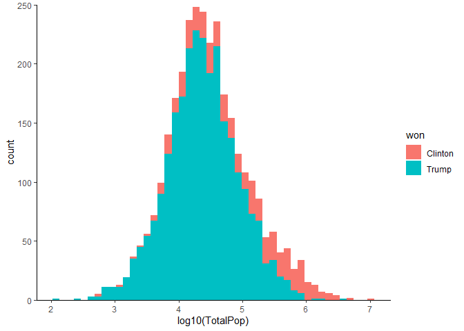

# Load libraries


```r
library(tidyverse)
library(knitr)
library(kableExtra)
```

## Load functions


```r
source("functions/table_styling.R")
source("functions/calculate_optimal_bin_number.R")
```

## Read data


```r
data <- read_tsv("data/US_2016_election_and_2015_census_data.tsv")
```

```
## Parsed with column specification:
## cols(
##   .default = col_double(),
##   State = col_character(),
##   County = col_character(),
##   per_point_diff = col_character(),
##   state_abbr = col_character(),
##   county_name = col_character(),
##   won = col_character()
## )
```

```
## See spec(...) for full column specifications.
```

# Data exploration

The dataset, with over 40 columns, is too big for a pairplot to be used. 
However, there are "groups" of variables that can be evaluated together.

## Population and demographics

Make a histogram of total population.


```r
# Calculate optimal number of bins
b <- calculate_optimal_bin_number(data %>% 
                                                                        select(TotalPop) %>% 
                                                                        mutate(TotalPop = log10(TotalPop)) %>% 
                                                                        as_vector())
# Plot a log10(TotalPop) histogram
data %>% 
  ggplot(aes(log10(TotalPop))) +
  geom_histogram(aes(fill = won), bins = b) +
  scale_y_continuous(limits = c(0, 250), expand = c(0, 0)) + # This is because I want 0 to be at the x axis
  theme_classic()
```

<!-- -->

It seems like Trump won a lot more counties than Clinton, and Clinton seems to
be more succesful in densely populated counties.

It would be interesting to see the average population density and demographics
by the candidate that won the county.


```r
data %>% 
  select(TotalPop:Pacific, won) %>%
  group_by(won) %>% 
  summarise_all("mean") %>% 
  kable(caption = "Means for demographic variables for counties that each candidate won.") %>% 
  table_styling()
```

<div style="border: 1px solid #ddd; padding: 0px; overflow-y: scroll; height:100%; overflow-x: scroll; width:100%; "><table class="table table-striped" style="margin-left: auto; margin-right: auto;">
<caption>Means for demographic variables for counties that each candidate won.</caption>
 <thead>
  <tr>
   <th style="text-align:left;position: sticky; top:0; background-color: #FFFFFF;position: sticky; top:0; background-color: #FFFFFF;"> won </th>
   <th style="text-align:right;position: sticky; top:0; background-color: #FFFFFF;position: sticky; top:0; background-color: #FFFFFF;"> TotalPop </th>
   <th style="text-align:right;position: sticky; top:0; background-color: #FFFFFF;position: sticky; top:0; background-color: #FFFFFF;"> Men </th>
   <th style="text-align:right;position: sticky; top:0; background-color: #FFFFFF;position: sticky; top:0; background-color: #FFFFFF;"> Women </th>
   <th style="text-align:right;position: sticky; top:0; background-color: #FFFFFF;position: sticky; top:0; background-color: #FFFFFF;"> Hispanic </th>
   <th style="text-align:right;position: sticky; top:0; background-color: #FFFFFF;position: sticky; top:0; background-color: #FFFFFF;"> White </th>
   <th style="text-align:right;position: sticky; top:0; background-color: #FFFFFF;position: sticky; top:0; background-color: #FFFFFF;"> Black </th>
   <th style="text-align:right;position: sticky; top:0; background-color: #FFFFFF;position: sticky; top:0; background-color: #FFFFFF;"> Native </th>
   <th style="text-align:right;position: sticky; top:0; background-color: #FFFFFF;position: sticky; top:0; background-color: #FFFFFF;"> Asian </th>
   <th style="text-align:right;position: sticky; top:0; background-color: #FFFFFF;position: sticky; top:0; background-color: #FFFFFF;"> Pacific </th>
  </tr>
 </thead>
<tbody>
  <tr>
   <td style="text-align:left;"> Clinton </td>
   <td style="text-align:right;"> 354177.87 </td>
   <td style="text-align:right;"> 173268.93 </td>
   <td style="text-align:right;"> 180908.94 </td>
   <td style="text-align:right;"> 15.379466 </td>
   <td style="text-align:right;"> 54.94251 </td>
   <td style="text-align:right;"> 21.281314 </td>
   <td style="text-align:right;"> 2.434908 </td>
   <td style="text-align:right;"> 3.5669405 </td>
   <td style="text-align:right;"> 0.1599589 </td>
  </tr>
  <tr>
   <td style="text-align:left;"> Trump </td>
   <td style="text-align:right;"> 54589.31 </td>
   <td style="text-align:right;"> 27035.47 </td>
   <td style="text-align:right;"> 27553.84 </td>
   <td style="text-align:right;"> 7.658362 </td>
   <td style="text-align:right;"> 81.75360 </td>
   <td style="text-align:right;"> 6.664381 </td>
   <td style="text-align:right;"> 1.322591 </td>
   <td style="text-align:right;"> 0.7707429 </td>
   <td style="text-align:right;"> 0.0512381 </td>
  </tr>
</tbody>
</table></div>

It seems like that not only did Clinton win more popolous countries but these
counties tended to be less white and a higher degree of minorites, i.e. they 
were more demographically diverse.


